# CSCE 590 Project 1

## Task 1: Install VS or VS Code

I went with installing VS Code, since I can only access my Azure Portal from
my Linux partition; hence making my only choice VS Code.

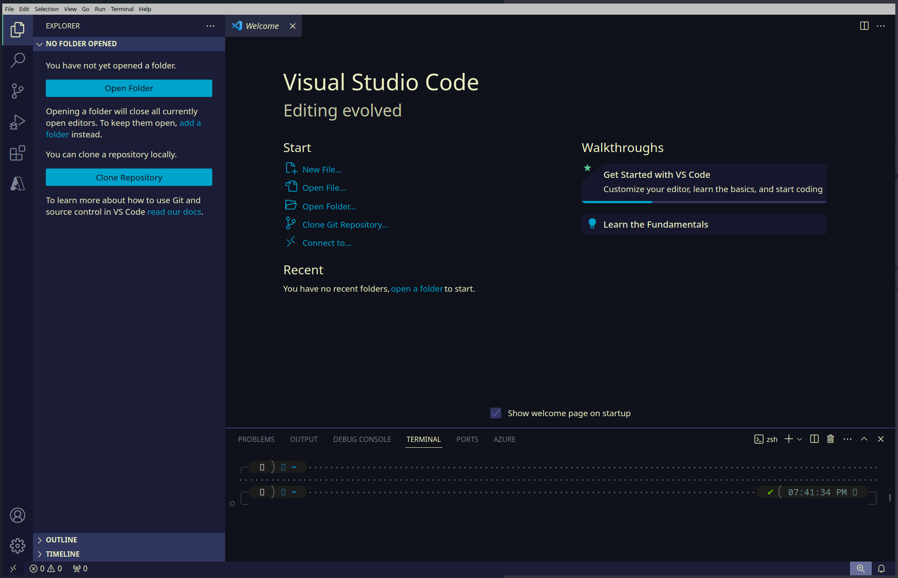

## Task 2: Create Web App From Azure Portal

I named my project, "csce590-solo-proj1," and decided to use this resource for
the ZIP deployment, VSCode deployment, and slot-deployment tasks.
You can visit the website via the link: [CSCE Solo Project 1](https://csce590-solo-proj1.azurewebsites.net)

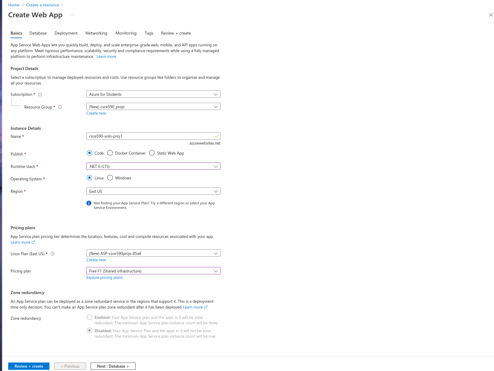
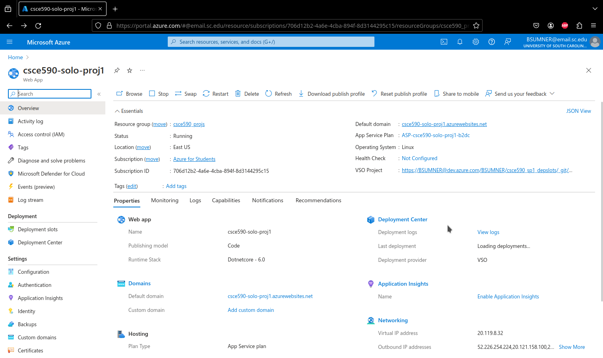

## Task 3: Deploy Sample Code from Portal

For this part, I used the Azure CLI tool, and used the ZIP deployment method,
where you compile a standalone binary for the dotnet project, using the command
below:

```shell
$ dotnet publish
```

After compiling, you then change directories into the target binaries' folder,
and zip the contents of that directory. Then in order to deploy it, use the azure
CLI too, "az", with the following parameters:

```shell
$ az webapp deployment source config-zip --src <zip archive name> \
--resource-group <target resources resource group name> \
--name <target resources name>
```

Zipping the binaries:

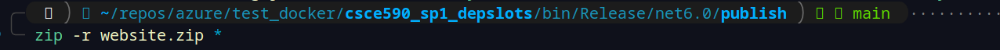

Deploying the zip-archived binaries to the Web App using Azure-CLI:

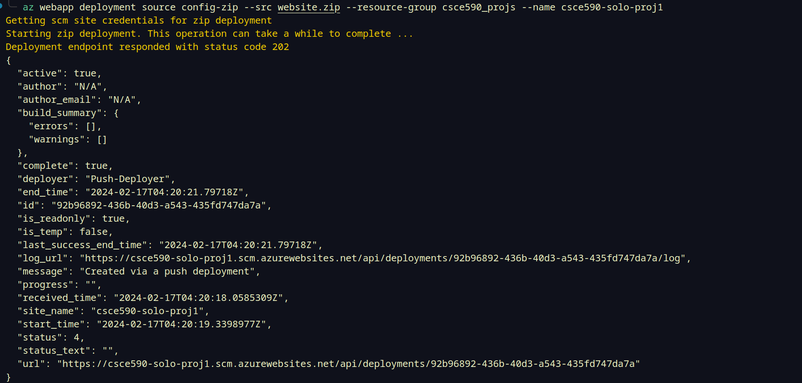

Confirmation that the deployment was successful:

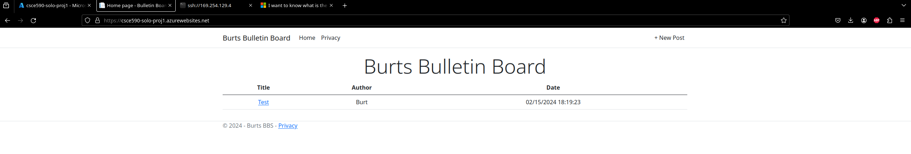

## What I Chose for my Web App

But wait, the screenshot above isn't the sample code! It's not! I decided I 
wanted to go beyond the bare minimum by only deploying the sample code, both 
because I wanted to turn something in I was satisfied with and I was paranoid as
to whether or not you all wanted to see our own work or just the sample code 
uploaded for the later tasks.

##### Quick Side Note:

I didn't know whether or not we were supposed to make our own Web App or not,
as the most information we were given was that the MSLearn Modules provide us
sample code to start with. That being said, when I saw that in the PDF for the App
project, it mentioned that we needed to link you all to the source code repo, 
I was paranoid that I was wrong, and we were expected to create our own web app,
so I decided I would rather be late to turn in something I was actually proud of
rather than just turn in the bare minimum with only the sample code and maybe 
some minimal aesthetic changes to satisfy the code change deployment task.
hence why I turned this in so late.

### My App: A Publicly Available Bulletin Board System

In order to get my project done in a feasible amount of time, I decided to do 
a simple Bulletin Board that uses Dotnet's webapp project template as a starting 
place, as well as EF Core and an Azure Cloud SQL Server to store the posts.
I call it: [Burt's Bulletin Board](https://csce590-solo-proj1.azurewebsites.net).

## Task 4 & 5: Update Web App Thru Code Change (Task 5) and Publish The Changes From Visual Studio (Code)

As said before, I was worried about whether or not y'all wanted us to add our own
nuance to the code we uploaded, so I decided to, yet again, further change the 
web app code we deploy for this task, too. As such, for this part, I decided to
fix an issue that appeared when the home page now had multiple posts to show.
The posts were out of order.

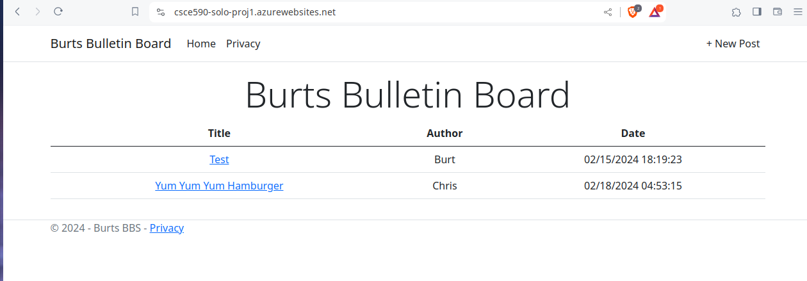

They were being ordered by ascending order, rather than descending. Quick and 
easy fix to deploy. Simply had to change the code below from:

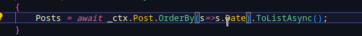

To:

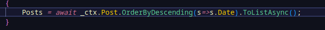

Now, the home page should display the most recent posts first. Now that the code 
has been changed, let's use VSCode's Azure extensions to perform our deployment
more easily. We simply have to go to the side panel tab for the Azure extension,
log into our Azure Portal through the extension's redirect to the login portal,
and find our target resource and hit deploy from its dropdown menu:

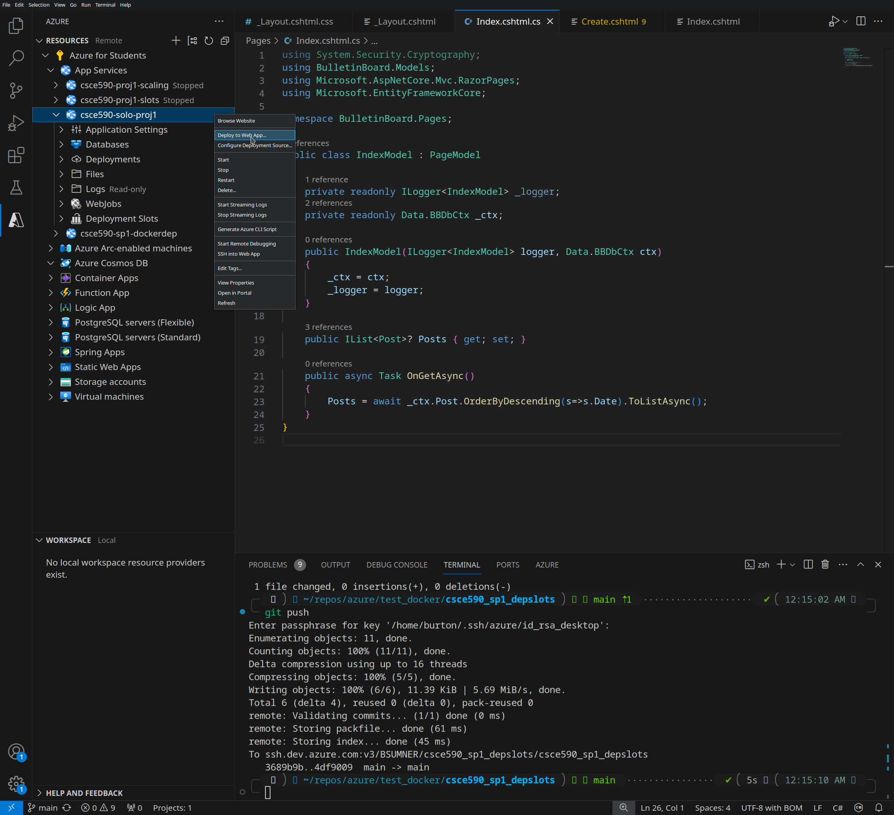

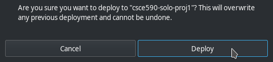

Now that we've published the changes using the Azure App Service extension for 
VSCode, we can see the changes reflected on the web app home page:

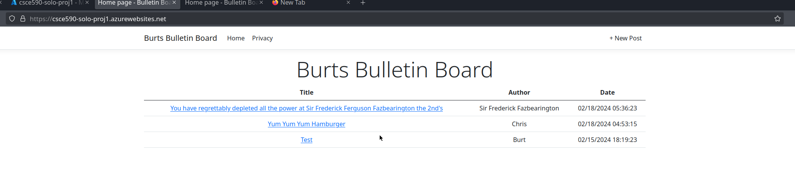

And it worked! Now, the homepage sorts by date, in descending order (i.e.: 
newest posts are at the top).


## Tasks 6 & 9: Create and Configure Deployment Slots (Task 6) & Scale Up Our Web App (Task 9)

I configured my deployment slots to use repos I created on Azure DevOps as the
code source.

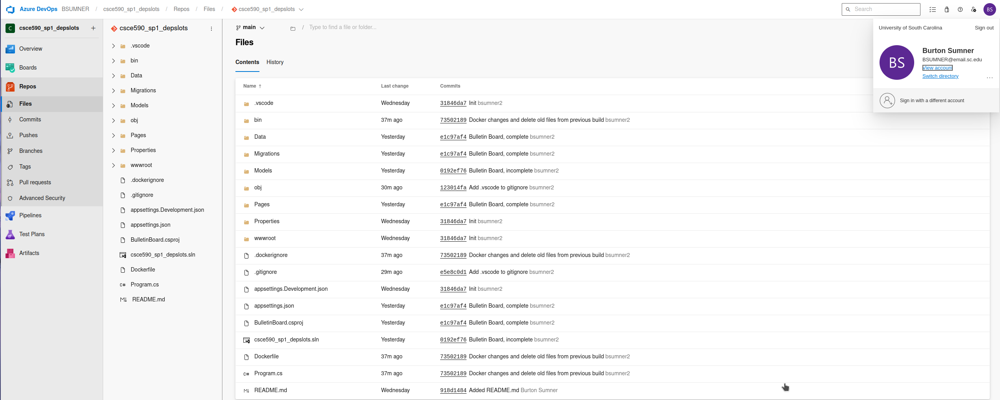

Before I do that, though, let's Scale Up our resource's pricing plan. 

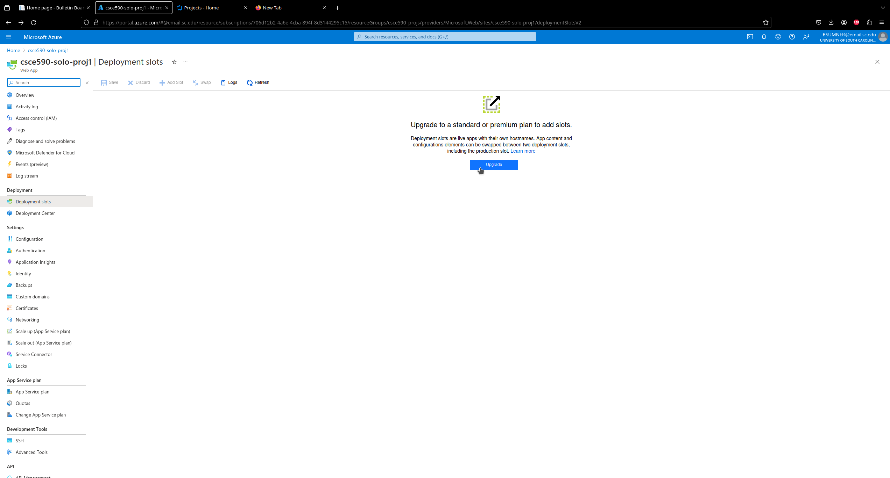

Originally, I was at the Free (F1) pricing plan, but in order to
have access to Deployment Slots, I needed to scale up my web app's pricing plan
to S1.

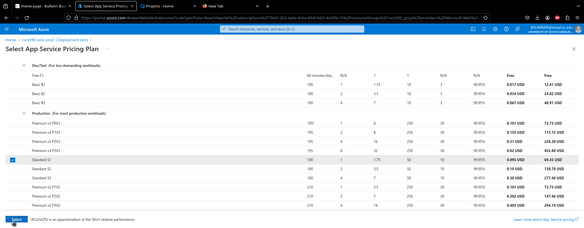

Now that we have scaled up from F1 to S1, we can implement deployment slot.

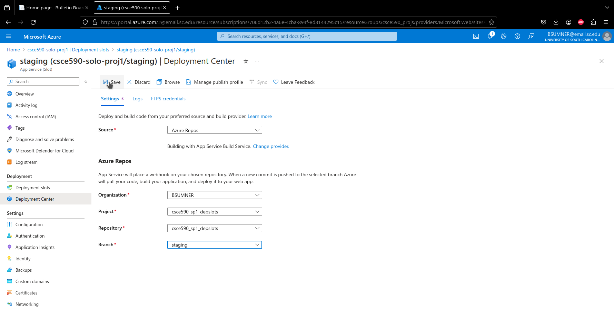

For the changes to implement for our staging branch, let's fix another logic bug
involving how post bodies are displayed. Since the posts are just being displayed as
paragraph bodies in the html, we need to go through the post body and split it
into an array of strings.

```cs
string[] bodyDelimited = post.Body.split("\n");  // Where \n delimits the string 
                                                 // into substrings in the array.
```

Then use a foreach loop, in the cshtml page for displaying posts, that iterates
through Model.BodyDelimited, and adds that line to the post body paragraph,
with an explicit newline tag,

```html
<br>
```

to explicitly get the browser to render a line break on the web page for each
newline escape char in the post body.

```cs
@foreach (string line in Model.BodyDelimited) {
    @line<br>
}
```

As it stands right now, the webpage for displaying posts only adds line breaks
wherever the browser sees fit, and just disregards any newline chars in the post
body. Which renders ASCII art, for example, complete gibberish.

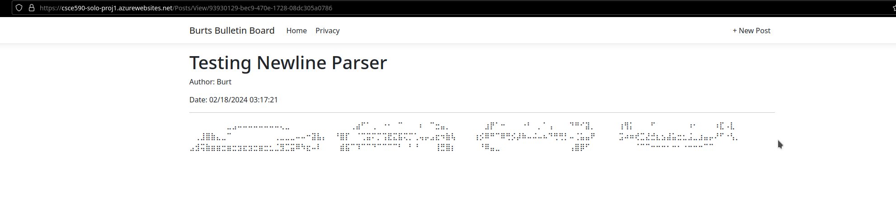

My perfectly good burger ASCII art rendered to what just looks like your average
brail poem (or I guess, *feels*, like? Get it? Because it's brail?) Anyway, let's
see how our staging slot's web app looks posting ASCII art now that we've added
code to parse out newline chars and pushed it to the staging branch of our Azure
DevOps repo.

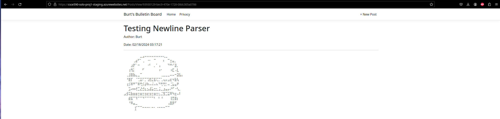

Awesome! The changes are live, oh and I forgot to mention, I also changed any 
mention of, "Burts Bulletin Board," on the webapp, to use proper grammar and 
display, correctly, as, "Burt's Bulletin Board," instead; so, we got to knock out
two birds with one stone! Now let's get prepared to swap the production 
and staging branches!

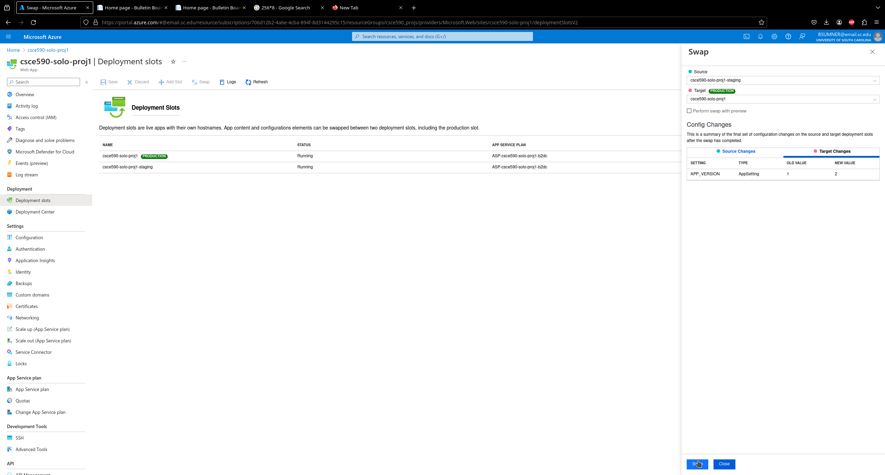

Let's do the honors and click, "Swap!"

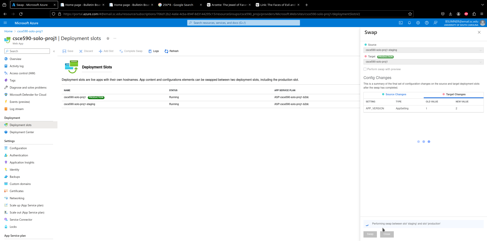

Now we wait for it to finish:

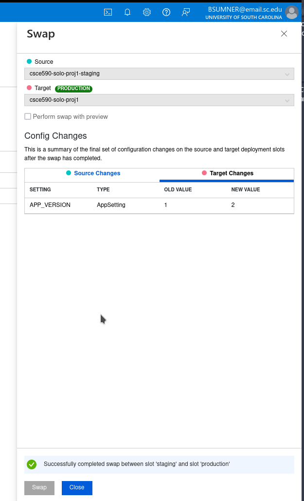

Now let's go to our [production slot's web URL](https://csce590-solo-proj1.azurewebsites.net),
and look at the, "Testing Newline Parser," post, and confirm that it displays our
ASCII art correctly. And it does!

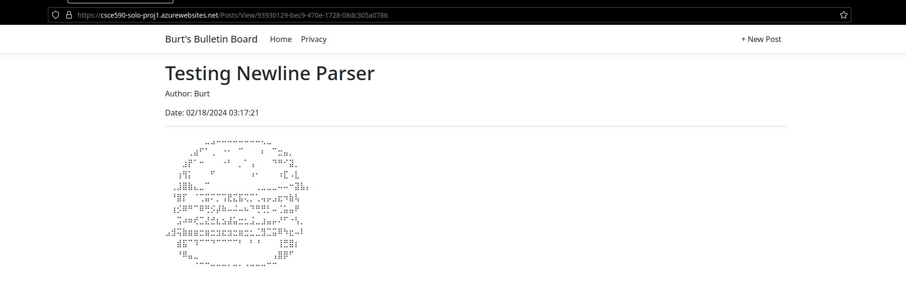

#### Quick Side Note: Tasks 7, 8, and 9 Will Be Performed On Containerized App

For tasks 7, 8, and 9, I will be performing these tasks on the Web App we create for
the containerized app instance hosting, since, for that Web App, I will actually be
using the Web App resource to host a containerized Web API, which will allow me to more easily
write a traffic simulating-client that can be used to get an idea of how much our 
metrics logs change after the scale out/up. Therefore, before we do these tasks,
I'm going to now talk about the container tasks, and return to Tasks 7, 8, and 9
after we set up our docker image-based containerized web app.

## Task 10: Create Azure Docker Registry


